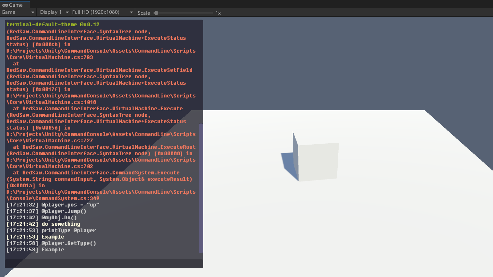

# UnityCommandLineInterface

[](https://openupm.com/packages/com.redsaw.commandline/)

[English Document](./README.md)

## 简介

这个项目是一个游戏内置的控制台项目,主要用于执行一些简短的命令或者函数,或者用于设置某些数值等

<div align=center>

</div>

https://github.com/529324416/UnityCommandLineInterface/assets/30776995/a2290fff-ffa5-421f-8a4a-a5274e9c6d87

## 特性：
- 使用简单，无需任何额外配置或者复杂学习流程
- 模块间高度解耦合，其内部组件可以单独使用
- 轻量级，无任何依赖
- 支持输入文本提示
- 支持自定义
- 全版本支持


## 如何使用

## 1.注册命令

命令的注册和旧版的命令系统是一致的，不同的点在于，旧版的系统会审查目标静态函数的参数列表能够正常解析，而新版的系统不会，任何错误都会在执行的时候报出。不过注册行为同样简单，只需要在静态函数之上添加一个`Command`特性即可。

```csharp
[Command("my_cmd")]
public static void SomeMethod(){
	/* do something here .. */
}
```

不过除了静态函数之外，新版系统还支持注册实例函数，不过注册实例函数只能手动注册，以及在拥有了**控制台变量**的情况下，注册实例函数的意义变得微乎其微。

## 2.执行命令

命令的执行和之前大有不同，首先，命令的执行有两种模式，第一种，你可以像执行一般的命令一样执行。

```
your_command args1 args2
```

但是同样，你可以像执行一个函数一样执行命令

```
your_command(args1, args2)
```

这么做的理由很简单，前者是继续维系执行简单命令的便捷，后者的意义在于，新版的命令系统支持获取命令的返回结果，于是在函数执行模式的时候，你可以对结果内部的信息继续访问。如下所示:

```
get_enemy("slime").Jump()
```

## 3.控制台变量

接着就是新版系统的重点了，新版控制台支持你注册一个控制台变量，并通过`@`对其进行访问，这会使得命令系统整体变得非常自由。假设你有一个主角，如下所示：

```csharp
public class Player : MonoBehaviour{

	public int health = 100;

	public void Jump(){
		// code for jump..
	}
}
```

你可以设置一个静态变量，并为该变量添加一个`CommandProperty`来注册一个控制台变量。如下所示：

```csharp
public class Player: MonoBehaviour{

	[CommandProperty("player")]
	public static Player Instance;
}
```

（当然，游戏启动的时候你得往Instance写入一个实例）

之后你就可以在控制台对其所有的内部信息进行访问了，不需要任何额外的参数，完全只借助于C#的反射系统以获取的强大的动态能力，下面这些命令都是支持且有效的。

```
@player.health = 100
@player.Jump()
```

同理，任何需要一个变量的地方都可以通过`@`来引用你需要的变量，比如作为其他命令的参数

```
@enemy.Atk(@player)
```

控制台变量可以注册给一个字段或者一个属性，这意味着同一个控制台变量可以代表着不同的对象，比如离玩家最近的Npc。

```csharp
[CommandProperty("nearest")]
public static Npc NearestNpc{
	get{
		// code for getting nearest npc..
	}
}
```

有了这个特性的支持，你可以将一组命令作为某个对象的子函数，不需要编写额外的信息，只需要将这个变量注册为控制台变量即可。

总的来说它大大提高了控制台的自由度

## 4.变量访问支持

新版的控制台支持访问成员和覆写成员，你可以通过一般点号或者中括号来对目标对象的成员或者子元素进行访问，前面已经展示了一些。类似于访问成员，或者覆写子元素都是支持的。

```
@player.DoSomething()
@player.buffs["buff_id"].AddTime(100)
@enemies["slime"] = @new_slime
```

当然，这种访问是可以连续的，就像正常的语法那样

```
@something.member.sub_member["elements"].member.sub_member.field.function().member
```

尽管这么做有些憨，这里面关于中括号的判断是根据目标对象来的，一般来说，系统会先判断目标对象是否为一个序列型的对象比如数组或者列表等，如果是的话，那么它会要求中括号内部的表达式为一个int字段，如果中括号内部的表达式无法得到一个int字段，这个访问就会失败并正常报错，同理作为字典也是一样的，只不过字典支持更多不同的键类型，所以字典的判断范围会更宽一些。

```
@some_dict[@non_string_type] = get_something()
```

比如你的字典是一个非字符串类型，那么你可以把其他控制台变量作为它的键值来访问或者覆写。当然，前提是它支持覆写。任何不支持的行为都会报错，只不过控制台会尽可能正确执行你输入的命令。所以最好的办法就是不要设置一些奇怪的命令。

## 5.参数解析器

旧版控制台有过一个参数解析器，这个解析器在新版里变为了控制台系统理解一般参数的最后手段。简单来说，普通的控制台变量其实只有以下几种

```
string
float
int
bool
null
```

这些也可以被称为是元类型，属于可以直接被解析出来的数据类型，一般来说是够用了。不过如果你希望控制台可以解析不同的数据类型，那么你可以通过注册参数解析器来实现。

举个简单的案例，对于主角的位置而言，它可能是一个`Vector3`类型，你也许希望可以像这样去设置主角的位置

```
@player.pos = "1. 1. 1."
```

但是显然，字符串是无法转换为位置的，如果你真的想这么做，或者有必要这么做的话，你可以注册一个参数解析器，如下所示：

```csharp
[CommandValueParser(typeof(Vector3))]
static bool ParseFunction(string input, out object data){
	// code used to parse your input str
}
```

这个函数只要符合签名即可，它的内部逻辑你可以自由编写，比如：

```csharp
static bool ParseFunction(string input, out object data){
	if(input == "复活点"){
		data = Vector3.zero;
		return true;
	}
	// other prase here ..

	data = default;
	return false;
}
```

那么你就可以这样使用了

```
@player.pos = "复活点"
```

当然，这里的双引号其实是可以取消的，但是我不建议这么做，因为系统在理解这个输入的时候会首先把`复活点`当成是一个命令，认为你希望执行一个命令获取它的返回值，如果复活点不是命令的话，系统才会尝试去搜索有没有解析器可以将其解析为目标类型的数据。

```
@player.pos = 复活点
```

所以尽量不要使用这种模棱两可的控制语句。

参数解析器一般用于一些比较特殊的情况或者非常复杂的数据类型，不便于手动设置的数据类型。像这里的`Vector3`类型的正确做法应该是什么呢？其实很简单，你可以注册一个这样的命令。

```csharp
[Command("v3")]
public static Vector3 BuildVector3(float x, float y, float z){
	return new Vector3(x, y, z);
}
```

然后像下面这样调用即可

```
@player.pos = v3(0, 0, 0)
```

## 6.注册Debug信息

如果希望直接获取该对象的一些信息，比如我输入了下面的命令到控制台

```
@player
```

控制台可以直接返回给我一组关于玩家的数据信息，像下面这样


这个功能属于附加功能，但是我也将其作为了控制台的一个内部特性来实现了。简单来说对于任何你希望了解的参数信息，你可以注册一个`DebugInfo`到它的字段或者属性用以获取它的信息

```csharp
public class Player : MonoBehaviour{
	
	[DebugInfo]
	public int health = 100;
}
```

这样一来，输入`@player`到控制台就可以直接获取player的所有DebugInfo了，输出如下所示

```
---------- Player start ----------
>Player.health: 100
---------- Player end ----------
```

你可以设置它的标题和色彩，如下所示：

```csharp
[DebugInfo("custom_title", Color = "#ff0000")]
```

### 6.1 父类追溯

它可以追溯所有父类的信息并从最初的父类开始往下依次传递，如果你有一个这样的继承链

```csharp
public class A{
	[DebugInfo]
	public int someInt = 999;
}

public class B{
	[DebugInfo]
	public float someFloat = 12.3;
}

public class C{
	[DebugInfo]
	public string someStr = "Hello World!";
}
```

如果你实例化了C并进行输出的话，你将获得

```
---------- C start ----------
>A.someInt: 999
>B.someFloat: 12.3
>C.someStr: Hello World!
---------- C end ----------
```

### 6.3 子类DebugInfo

如果被注册为DebugInfo的对象是一个内部也拥有数个DebugInfo的对象，那么你可以为其类型注册一个`DebugObject`特性，如下所示

```csharp
public class A{
	[DebugInfo("my_object")]
	public B b = new B();
}

[DebugObject]
public class B : MonoBehaviour{
	[DebugInfo("name")]
	public string Name => this.gameObject.name;

	[DebugInfo]
	public string age = 25;
}
```

如果你输出了A，将会获得下列信息

```
---------- C start ----------
>----[B]
>    B.name: "instanceB"
>    B.age: 25
---------- C end ----------
```

不过这样一来，可能会出现环状数据展开，比如B引用了C但C又引用了B，所以你可以设置一个展开深度，超过这个深度时，系统会丢弃其子类信息，默认深度为4。

## 7.输入提示

旧版的控制台系统的提示很好做，只需要搜索所有的命令然后按照一定的相似度函数来进行提示即可。新版的系统多出来了很多信息，总的来说它支持三个元素的提示，即命令，控制台变量和成员对象。

不过我第一次做提示引擎，压根不知道怎么做最好，我采用了链式字符自动机的做法，你每输入一个字符都会根据规则改变现有字符状态机的状态从而让控制台知悉你现在正在输入什么，进而弹出提示。

这个部分确实难做，要在提示和语法的兼容度之间寻找一个平衡蛮难的。但还是做出来了，不过这部分没有用户和代码相关的部分。


字符串相似度采用了编辑距离算法，也就是比较有名的莱文斯坦因字符串距离算法。对你的输入和目标字符串之间计算编辑距离并按照相似度排序。查询时会产生一定空间的缓存，用以复用最近输入的查询结果，从而降低计算损耗。

## 8.控制台日志

新版控制台最大的一个特点在于解除了日志输出与渲染的耦合，这意味着你控制台本体只会存储日志信息，不会进行任何渲染行为，你可以向控制台索要某个特定类型的日志信息，比如只显示错误信息或者只显示一般信息。

Unity有一个自带的日志类型，`LogType`，不过你可以定义自己的日志枚举类型，或者直接使用Unity的日志类型。

```csharp
/* intialize console */
console = new ConsoleController<LogType>(
    consoleRenderer,
    new UserInput(),

    inputHistoryCapacity: inputHistoryCapacity,
    commandQueryCacheCapacity: commandQueryCacheCapacity,
    alternativeCommandCount: alternativeCommandCount,
    shouldRecordFailedCommand: shouldRecordFailedCommand,
    outputWithTime: shouldOutputWithTime,
    outputStackTraceOfCommandExecution: shouldOutputVMExceptionStack
);
```

以及你可以自由的决定这些日志该如何存储或者保存到什么位置。


## 其他

### 适用的Unity版本

Unity 2018.03+

这个项目与Unity是高度解耦合的，所以它几乎可以用于所有版本的Unity，你可以为它定义自己的UI来使用，这个项目提供了默认的Unity实现，你可以学习或者自己改造。

### 特性支持：基础运算

该系统是为了能够进行方便的debug工作而设计的，所以它的定位并不是一个完整的编程语言，所以它现在还不支持基础的运算，比如数学运算，或者逻辑运算等。如果对该类特性有需求的话，可以在github提出，如果的确有必要的话，我会实现的。