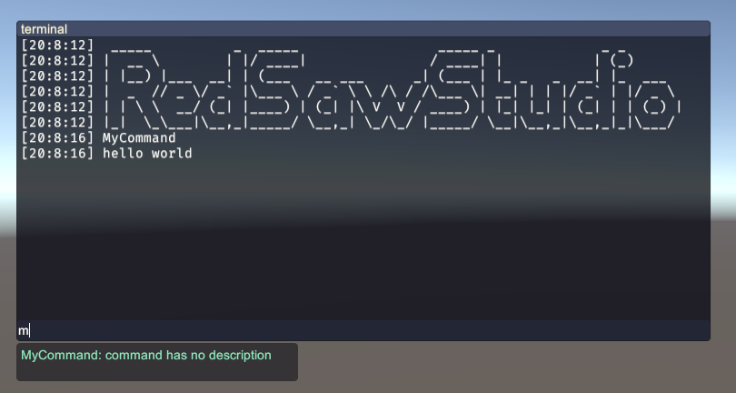

# UnityCommandLineInterface

[English Document](./README.md)

## 简介

这个项目是一个游戏内置的控制台项目，下面是项目的一些截图

<div align=center>

</div>

它由以下三个部分组成：

- **命令系统**
- **控制台行为逻辑与接口定义**
- **控制台渲染器实现**

这三个部分是高度解耦合的，也就是控制台的行为逻辑与命令系统可以自由的拆解到其他的项目中。以下是关于三个部分的使用文档。

## 如何使用

### 如何添加自定义命令

该项目使用特性和反射来定义和收集命令，你可以通过给函数挂载`Command`特性来定义你自己命令

```c#
[Command]
static void MyCommand(){
    UnityEngine.Debug.Log("hello world");
}
```

这样这个函数就会被识别为一个命令，并且你可以输入 *`MyCommand`* 来执行该函数，之间不需要任何多余的配置或者操作

<div align=center>

</div>

你可以设置命令的名称，描述和标签

```c#

[Command("my_command")]
static void DefinedCommandName(){
    UnityEngine.Debug.Log("hello world");
}

[Command("with_desc", Desc = "add some descriptions here")]
static void AddSomeDescriptions(){
    UnityEngine.Debug.Log("hello world");
}

[Command("with_tag", Tag = "disable_for_user")]
static void CommandWithTag(){
    UnityEngine.Debug.Log("command is disabled for user");
}

[Command("with_args")]
static void Add(int a, int b){
    UnityEngine.Debug.Log(a + b);
}

```

并不是所有的静态函数都可以被识别为一个命令，要求命令的参数列表使用以下类型的参数

```
Int
String
Float
Double
Bool
Char
Byte
Short
Long
UShort
UInt
ULong
Decimal
SByte
```

不过大部分情况下这些参数已经足够使用了，但是如果你希望一些特殊的函数能够使用其他的参数类型的话，可以通过注册一个类型解析函数给命令系统，比如你有一个采用`Enum`类型作为参数的函数：

``````c#
[Command]
static void TestCommand(MyEnum value){
	// do something..
}
``````
默认情况下它是不会被识别为函数的，此时你可以注册一个格式如下所示的类型解析函数


``````c#
bool ParseFunc(string args, out object value);
``````

注册方法是给一个静态函数挂载`CommandParameterParser`特性，这个特性函数应该解析给定的字符串并通过`out`关键字返回一个`object`数据，返回一个布尔值表示这个字符串是否有效。


``````c#
[CommandParameterParser(typeof(MyEnum))]
static bool MyEnumParser(string value, out object data){

    if(System.Enum.TryParse<MyEnum>(value, out var result)){
        data = result;
        return true;
    }
    data = null;
    return false;
}
``````

之后它就可以正常识别并使用了

<div align=center>

</div>

这个特性支持你构建更多特殊的命令，比如你的命令函数需要一个`Player`或者`Enemy`这样的非基础类型参数，你可以注册一个类似的函数，并将一个字符串解析为`Player`，解析方法由你自己定义，比如下面这样

```c#

public class GameEntity{/* some code here..*/}

[Command("handle_game_entity")]
static void DebugCommand(GameEntity entity){
    // do something to entity..
}

[CommandParameterParser(typeof(GameEntity))]
static bool GameEntityParser(string input, out object data){
    /* fake code, just for example */

    switch(input){
        case "A":
        case "B":
        case "C"
            data = gameEntities.GetByName(input);
            return true;
        default:
            data = null;
            return false;
    }
}

```

之后你就可以通过输入 `handle_game_entity 'A'` 来对游戏对象A做一些操作了。

## 自定义命令行系统

### 自定义输入

等待文档的完善

### 自定义外观

等待文档的完善

## 其他

### 适用的Unity版本

Unity 2018.03+

这个项目与Unity是高度解耦合的，所以它几乎可以用于所有版本的Unity，你可以为它定义自己的UI来使用，这个项目提供了默认的Unity实现，你可以学习或者自己改造。


## TODO List

- [x] **添加命令标签 v0.11** *@2024/01/06*
      <br> *现在你可以给命令添加标签，用于标签给命令分组用于实现一些特殊的限制，或者测试约束*
- [x] **添加命令查询缓存 v0.11** *@2024/01/06*
      <br> *现在查询命令会有最近20条查询记录的缓存，用一点空间换取了更高效的查询速度*
- [x] **支持接受Unity的Debug.Log输出 v0.11** *@2024/01/06*
      <br> *控制台提供了一个开关项用于选择是否监听UnityEngine.Debug.Log，打开时，该函数的输出结果会同时输出到控制台中，从而使你不用改变当前游戏的Debug命令*
- [ ] ~~**重构控制台的封装结构 v0.12**~~
- [ ] ~~**生成日志文件 v0.13**~~
- [ ] **输出过滤 v0.13**
- [ ] **添加更多的控制台渲染器行为逻辑** v0.2