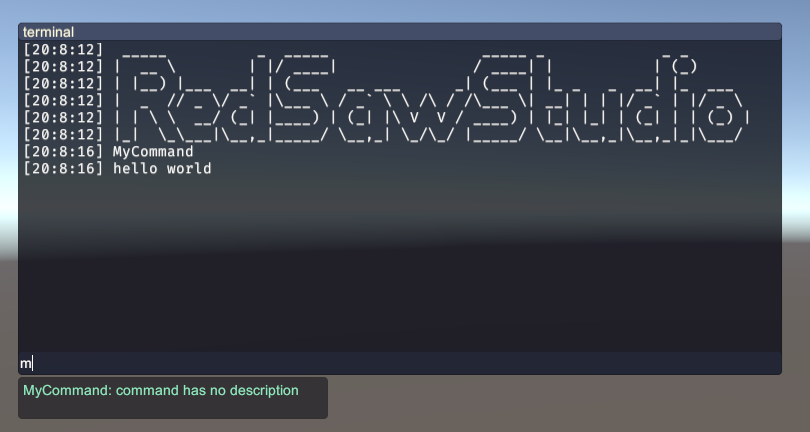

# UnityCommandLineInterface

[](https://openupm.com/packages/com.redsaw.commandline/)

[中文文档](./README-ch.md)

## Summary
this project is an inner game command console, usually use to execute some short command or set/get property

<div align=center>

</div>

<div>
<video src="./Res/usage.mp4" style="zoom:80%">
</div>


## Features：
- **Easy to use**, no need to do much learning
- **Lightweight**, no dependencies
- **Input text suggestion**
- **Support all versions of Unity**
- **Highly Decoupled**,
- **Easy to port to other platforms**

## Usage

### 1.How add custom commands

The system use System.Reflections to define and collect commands, you can define your commands by adding `Command` to a static method


```c#
[Command]
static void MyCommand(){
    UnityEngine.Debug.Log("hello world");
}
```

to call this function, just input *`MyCommand`* to the console, and no more configures.

<div align=center>

</div>

you can set name, description and tag for your commands

```c#

[Command("my_command")]
static void DefinedCommandName(){
    UnityEngine.Debug.Log("hello world");
}

[Command("with_desc", Desc = "add some descriptions here")]
static void AddSomeDescriptions(){
    UnityEngine.Debug.Log("hello world");
}

[Command("with_tag", Tag = "disable_for_user")]
static void CommandWithTag(){
    UnityEngine.Debug.Log("command is disabled for user");
}

[Command("with_args")]
static void Add(int a, int b){
    UnityEngine.Debug.Log(a + b);
}

```

### 2.How to add custom properties

The CommandProperty is that you can visit on console by `@`, to register an command property, you just need to add an attribute named `CommandProperty` like this:

```C#
[CommandProperty]
public static Player player;
```

then you can visit it by `@player`, not only the field itself but also all its fields, properties and methods.


```
@player.Jump()
@player.health = 100
@player.tag = "something"
```

and any other command need the property as a parameter.

```
some_command @player
```

the `@` is a syntax design which try to find the CommandProperty defined by you, but if we try to assign value to an command property doesn't existed, then the system would created a temp local variable. it would be cleared after quitting the game.

```
@pos = @player.pos
print @pos          // write @player.pos to @pos
@player.pos = @pos  // set back
```

### 3.How to add value parser

Maybe we need to set some values in different type instead of some common types like string or int, but the system is not a completed Programming Language, so it cannot defined value on console, but you can register ValueParser for you can easy parse values to target type.
for example, while we input `@player.pos = xxx`, assume that `pos` is a value of type `UnityEngine.Vector3`, you can register a ValueParse like this:

```C#
[CommandValueParser(typeof(Vector3), Alias = "v3")]
public static bool ParseVector3(string input, out object data){
    string[] result= input.Trim(new char[]{'(', ')'}).Split(',');
    if(result.Length == 3){
        if( float.TryParse(result[0], out float x) && 
            float.TryParse(result[1], out float y) && 
            float.TryParse(result[2], out float z)){

            data = new Vector3(x, y, z);
            return true;
        }
    }
    data = default;
    return false;
}
```

we send a `Type` parameter to tell system, the ValueParser is target on `Vector3`, and you can set an Alias for it, here is `v3`. of course, you can determine the detailed logic, for example, if you want to parse `"up"` to `Vector3.up`, you can do it like this :

```C#
switch(input){
    case "up":
        data = Vector3.up;
        return true;
    /* ... */
}
```
then, when system need `Vector3` as parameter or input, it will try to find a suitable ValueParser to handle it

```
@player.pos = "1.0, 1.0, 1.0"
```

according to your parse method, the command input would be like this:

```
@player.pos = '1. 1. 1.'
@player.pos = 'up'
@player.pos = 'pt_revival'
```

and if we just want to manually pointed the convert type, we can use `:` behind your string input like this

```
print "1. 1. 1.":v3
```

maybe some wired, but it just work!

### About more usage


since it can directly access the child elements of an object, it may become ambiguous when dealing with certain issues in certain situtations, Therefore, let's take a look at some situations about system how to handle the strange input.

*Wait for editing*


## Other

### UnityEngine Versions

Unity 2018.03+

it support all version.

### Feature Support: Basic Calculation

The system is designed for convenient debugging work, so its positioning it not a complete programing language, so it currently does not support basic operations such as mathematical or logical operations, if there is a need for this feature, you can proposed on Github, if it is indeed necessary, I will implement it.