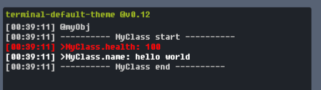

# UnityCommandLineInterface

[](https://openupm.com/packages/com.redsaw.commandline/)

[中文文档](./README-ch.md)

## Summary
this project is an inner game command console, usually use to execute some short command or set/get property

<div align=center>

</div>


https://github.com/529324416/UnityCommandLineInterface/assets/30776995/a2290fff-ffa5-421f-8a4a-a5274e9c6d87


## Features：
- **Easy to use**, no need to do much learning
- **Lightweight**, no dependencies
- **Input text suggestion**
- **Support all versions of Unity**
- **Highly Decoupled**,
- **Easy to port to other platforms**

## Usage

## 1.Register Commands

Register a command is easy, you just need to add an `Command` attribute to your static method.

```csharp
[Command("my_cmd")]
public static void SomeMethod(){
	/* do something here .. */
}
```

but system also support to add instance method, but now system have a new feature **CommandProperty**, so it's meaningless to register instance method

## 2.Execute Commands

command can be executed in two ways, the first way like this:

```
your_command args1 args2
```

but you can execute it like a method as well

```
your_command(args1, args2)
```

the first way keep it easy to execute a command, and the second way provide the ability to visit the member of return value looks like below.

```
get_enemy("slime").Jump()
```

## 3.Console Variable

the new console supports you to register a console variable and access it through `@`, this would make the overall command system very free, assuming that you have an object like this :

```csharp
public class Player : MonoBehaviour{

	public int health = 100;

	public void Jump(){
		// code for jump..
	}
}
```
you can setup a static variable, and add an `CommandProperty` attribute for it to register a console variable

```csharp
public class Player: MonoBehaviour{

	[CommandProperty("player")]
	public static Player Instance;
}
```
(you must write a Player instance into the static variable while the game start)

Then you can access the inner member of the `Player`, its all rely on C#'s Reflection System, you can use the commands like below:

```
@player.health = 100
@player.Jump()
```

Similarly, anywhere you need a variable, you can use `@` to reference the variable you need, for example, as a parameter to other commands

```
@enemy.Atk(@player)
```

the `CommandProperty` can be added to a Field or a Property, this means the console variable can return different value, like "the Npc nearest to player"


```csharp
[CommandProperty("nearest")]
public static Npc NearestNpc{
	get{
		// code for getting nearest npc..
	}
}
```

## 4.Access console variable

you can access or overwrite member of console variable through `.` or `[]`

```
@player.DoSomething()
@player.buffs["buff_id"].AddTime(100)
@enemies["slime"] = @new_slime
```

of course, the access is continues like normal programming language

```
@something.member.sub_member["elements"].member.sub_member.field.function().member
```

the `[]` has some special, it would check if the target member is a sequence object like an Array or List, if it is, then it requires the expression inner `[]` to be an Interger value. 

The Dictionary supports more key type, so the the judgment range of the dictionary would be wider.

```
@some_dict[@non_string_type] = get_something()
```

for example, your dictionary key type is a non-string type, you can use other console variables as the key to read or write.

## 5.Value Parse

the normal value types supported by the CommandSystem has only 5.

```
string
float
int
bool
null
```

you can call these types as meta-type, it can be parsed by command system directly, generally speaking, it is sufficient to use. However, if you want the console to be able to parse different data types, you can do so by reigstering a value parser.

for example, the position of the player maybe a `Vector3` type, you may wish to set the position of player like this:

```
@player.pos = "1. 1. 1."
```

Obviously, strings cannot be converted to `Vector3`, if you really want to do this, or if it's necessary to do so, you can register a 
ValueParser as follows:

```csharp

[CommandValueParser(typeof(Vector3))]
static bool ParseFunction(string input, out object data){
	// code used to parse your input str
}
```

the parse logic is totally free by you. for example, you can parse 'revival_point' to `Vector3`

```csharp
static bool ParseFunction(string input, out object data){
	if(input == "revival_point"){
		data = Vector3.zero;
		return true;
	}
	// other prase here ..

	data = default;
	return false;
}
```

then you can use the command as follows:

```
@player.pos = "revival_point"
```

the double quotation here is not necessary, but it's not suggestted to do like this. the system would first consider 'revival_point' to a command the try to execute it to get return value. the system would try parse it to `Vector3` only if it cannot find a command named 'revival_point'

```
@player.pos = revival_point
```

so you'd better not to use such ambiguous commands;

the ValueParser usually used in some special suitations or complex data type, if you want to parse `Vector3`, the right way is registering a command like this:

```csharp
[Command("v3")]
public static Vector3 BuildVector3(float x, float y, float z){
	return new Vector3(x, y, z);
}
```

and use it as follows

```
@player.pos = v3(0, 0, 0)
```

## 6.Register Debug Infos

it you want to show the information of target object, for example, you just input '@player' to the console.

```
@player
```

the console could output the player informations likes below:



to fetch the information structure, you can add an `DebugInfo` attribute to target field or property 

```csharp
public class Player : MonoBehaviour{
	
	[DebugInfo]
	public int health = 100;
}
```

In this way, by entering `@player` to the console, you can directly obtain all DebugInfo of the player, and the output is as follows:

```
---------- Player start ----------
>Player.health: 100
---------- Player end ----------
```

you can set title and color for it.

```csharp
[DebugInfo("custom_title", Color = "#ff0000")]
```

### 6.1 Tracing Parent Class

system would trace all its parent class, and output the DebugInfo of the original parent class to the target class one by one

```csharp
public class A{
	[DebugInfo]
	public int someInt = 999;
}

public class B{
	[DebugInfo]
	public float someFloat = 12.3;
}

public class C{
	[DebugInfo]
	public string someStr = "Hello World!";
}
```

if you try to show the DebugInfo of C, you will get:

```
---------- C start ----------
>A.someInt: 999
>B.someFloat: 12.3
>C.someStr: Hello World!
---------- C end ----------
```

### 6.3 DebugInfo of complex member

if the member which has beed reigstered as a DebugInfo and its also have inner DebugInfos, you can add an `DebugObject` attribute to the target class:

```csharp
public class A{
	[DebugInfo("my_object")]
	public B b = new B();
}

[DebugObject]
public class B : MonoBehaviour{
	[DebugInfo("name")]
	public string Name => this.gameObject.name;

	[DebugInfo]
	public string age = 25;
}
```

if you try to ouput A, you will get this:

```
---------- C start ----------
>----[B]
>    B.name: "instanceB"
>    B.age: 25
---------- C end ----------
```

However, in this way, there may be circular data reference, such as B referencing C and C referencing B again, so you can set and depth to limit the circular data reference, if depth exceeds the limitation, system will discard the more informations, the default depth limitation is 4

## 7.Input Suggestion

nothing to describe

.png)

## 8.Console Logs

the new system has decoupled the output and render behaviours, this means the console only save the log but don't care how to render it. but you need to provide an logType to mark the logs. you can set it while you initialize the game console.

```csharp
/* intialize console */
console = new ConsoleController<LogType>(
    consoleRenderer,
    new UserInput(),

    inputHistoryCapacity: inputHistoryCapacity,
    commandQueryCacheCapacity: commandQueryCacheCapacity,
    alternativeCommandCount: alternativeCommandCount,
    shouldRecordFailedCommand: shouldRecordFailedCommand,
    outputWithTime: shouldOutputWithTime,
    outputStackTraceOfCommandExecution: shouldOutputVMExceptionStack
);
```
and you can decide where to save the logs.

## Other

### UnityEngine Versions

Unity 2018.03+

it support all version.

### Feature Support: Basic Calculation

The system is designed for convenient debugging work, so its positioning it not a complete programing language, so it currently does not support basic operations such as mathematical or logical operations, if there is a need for this feature, you can proposed on Github, if it is indeed necessary, I will implement it.
